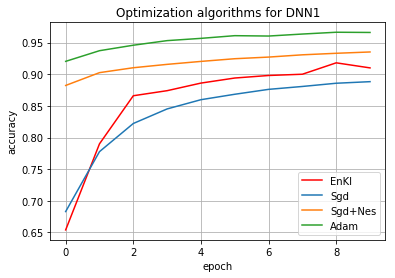

# Ensemble-Kalman-for-Neural-Network
Project for master thesis (2019)

## Introduction
Deep learning algorithms usually require a high amount of numerical computations. This typically refers to algorithms that solve the given problem by the methods of updating the estimated parameters via an iterative process, called as the optimization algorithms.

The work focuses on the learning methods in deep neural networks for supervised learning problems, specifically it introduces the new derivative-free optimization method based on Iterative Ensemble Kalman method for inverse problem (IEnK). This method was proposed by Kocachki and Stuart (2018), who have demonstrated that IEnK method significantly outperform the traditional SGD optimization methods in training neural networks (CNN, RNN).

## Implementation details
The IEnK algorithm was written in Python version 3.6 and the training was done on Intel Core i7-5650U CPU with the MNIST dataset. In the thesis we have simplified the algorithm to the learning rate of the real number. This simplified IEnK algorithm was written for the simple MLP architecture with 1 hidden layer.

## Getting Started
This code is written based on the python library numpy. Here we used cross entropy to valuate the loss.

## Running the Codes
```
main.py
```
Here we can modify the learning rate, epoch and batch size to train the simple MLP. Moreover, the trained weights will be stored in the user defined file, which will be later used for test and prediction.

```
=== Epoch: 0/10 === Iter:500 === Loss: 2.39 === BAcc: 0.10 === TAcc: 0.10 === Remain: 12 Hrs 0 Mins 0 Secs ===
=== Epoch: 0/10 === Iter:1000 === Loss: 2.35 === BAcc: 0.13 === TAcc: 0.11 === Remain: 12 Hrs 0 Mins 0 Secs ===
=== Epoch: 0/10 === Iter:1500 === Loss: 2.35 === BAcc: 0.12 === TAcc: 0.11 === Remain: 11 Hrs 0 Mins 0 Secs ===
=== Epoch: 0/10 === Iter:2000 === Loss: 2.33 === BAcc: 0.11 === TAcc: 0.11 === Remain: 12 Hrs 0 Mins 0 Secs ===
=== Epoch: 0/10 === Iter:2500 === Loss: 2.30 === BAcc: 0.12 === TAcc: 0.11 === Remain: 11 Hrs 0 Mins 0 Secs ===
=== Epoch: 0/10 === Iter:3000 === Loss: 2.30 === BAcc: 0.12 === TAcc: 0.11 === Remain: 11 Hrs 0 Mins 0 Secs ===
=== Epoch: 0/10 === Iter:3500 === Loss: 2.27 === BAcc: 0.14 === TAcc: 0.12 === Remain: 11 Hrs 0 Mins 0 Secs ===
=== Epoch: 0/10 === Iter:4000 === Loss: 2.26 === BAcc: 0.16 === TAcc: 0.12 === Remain: 10 Hrs 0 Mins 0 Secs ===
=== Epoch: 0/10 === Iter:4500 === Loss: 2.24 === BAcc: 0.19 === TAcc: 0.13 === Remain: 10 Hrs 0 Mins 0 Secs ===
=== Epoch: 0/10 === Iter:5000 === Loss: 2.24 === BAcc: 0.19 === TAcc: 0.14 === Remain: 10 Hrs 0 Mins 0 Secs ===
=== Epoch: 0/10 === Iter:5500 === Loss: 2.21 === BAcc: 0.24 === TAcc: 0.15 === Remain: 10 Hrs 0 Mins 0 Secs ===
=== Epoch: 0/10 === Iter:6000 === Loss: 2.20 === BAcc: 0.20 === TAcc: 0.15 === Remain: 10 Hrs 0 Mins 0 Secs ===
=== Epoch: 0/10 === Iter:6500 === Loss: 2.16 === BAcc: 0.27 === TAcc: 0.16 === Remain: 10 Hrs 0 Mins 0 Secs ===
=== Epoch: 0/10 === Iter:7000 === Loss: 2.16 === BAcc: 0.27 === TAcc: 0.17 === Remain: 10 Hrs 0 Mins 0 Secs ===
=== Epoch: 0/10 === Iter:7500 === Loss: 2.18 === BAcc: 0.25 === TAcc: 0.17 === Remain: 11 Hrs 0 Mins 0 Secs ===
=== Epoch: 0/10 === Iter:8000 === Loss: 2.17 === BAcc: 0.26 === TAcc: 0.18 === Remain: 10 Hrs 0 Mins 0 Secs ===
=== Epoch: 0/10 === Iter:8500 === Loss: 2.15 === BAcc: 0.27 === TAcc: 0.18 === Remain: 10 Hrs 0 Mins 0 Secs ===
=== Epoch: 0/10 === Iter:9000 === Loss: 2.12 === BAcc: 0.25 === TAcc: 0.19 === Remain: 10 Hrs 0 Mins 0 Secs ===
=== Epoch: 0/10 === Iter:9500 === Loss: 2.11 === BAcc: 0.31 === TAcc: 0.19 === Remain: 10 Hrs 0 Mins 0 Secs ===
=== Epoch: 0/10 === Iter:10000 === Loss: 2.09 === BAcc: 0.30 === TAcc: 0.20 === Remain: 10 Hrs 0 Mins 0 Secs ===
=== Epoch: 0/10 === Iter:10500 === Loss: 2.09 === BAcc: 0.33 === TAcc: 0.21 === Remain: 10 Hrs 0 Mins 0
```

## Results
* learning rate: 0.001
* batch size: 500
* number of particles for ensemble: 10

### Training plot


### Test accuracy
SGD: 0.8922;
NAG: 0.936;
Adam: 0.9699;
IEnK: 0.886.

